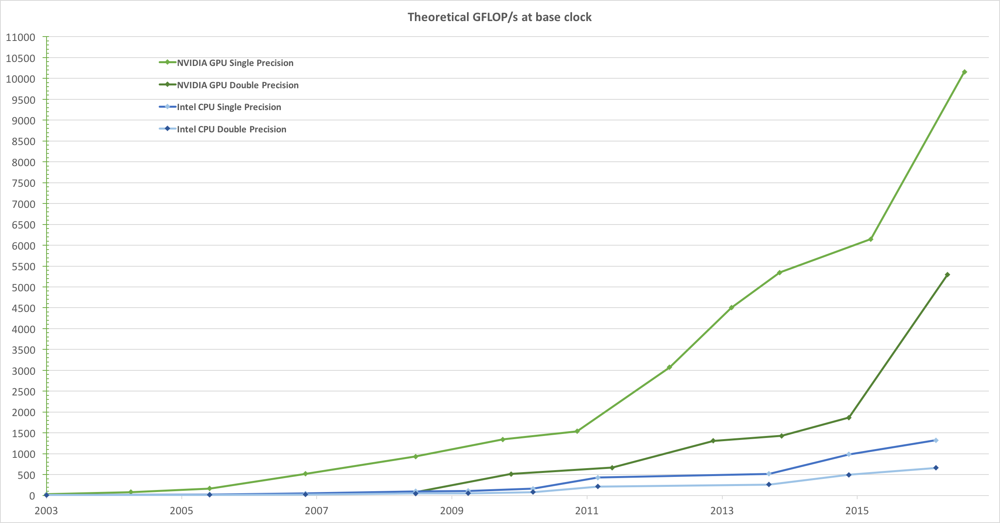
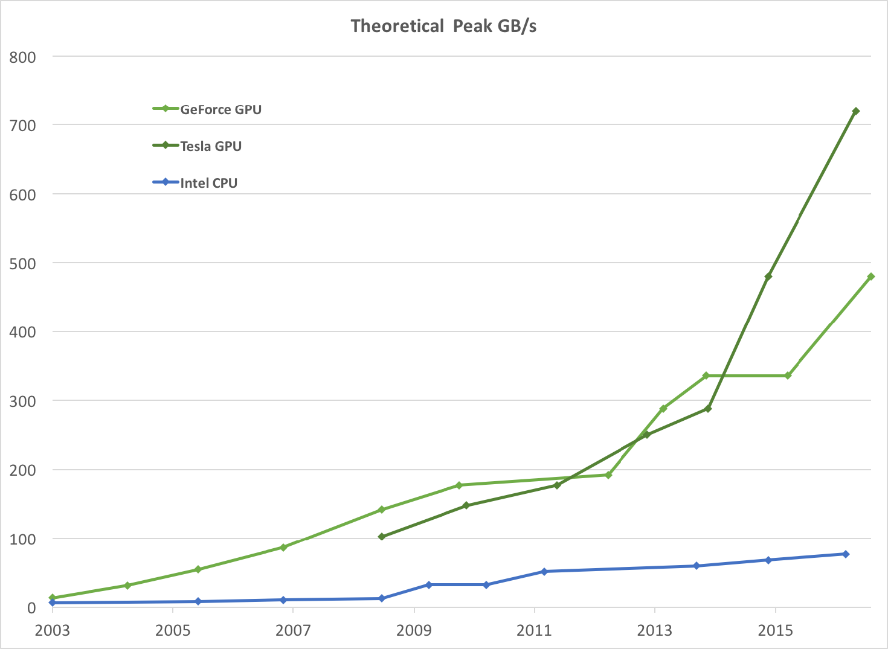
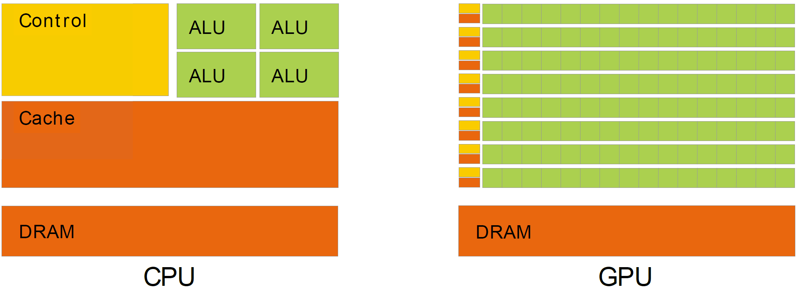
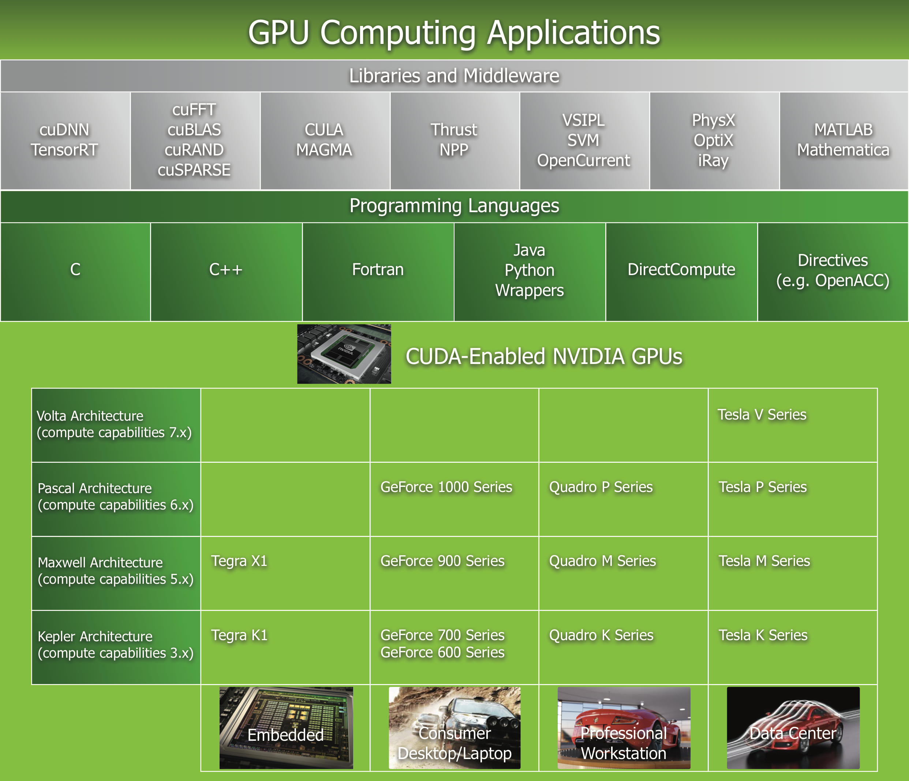
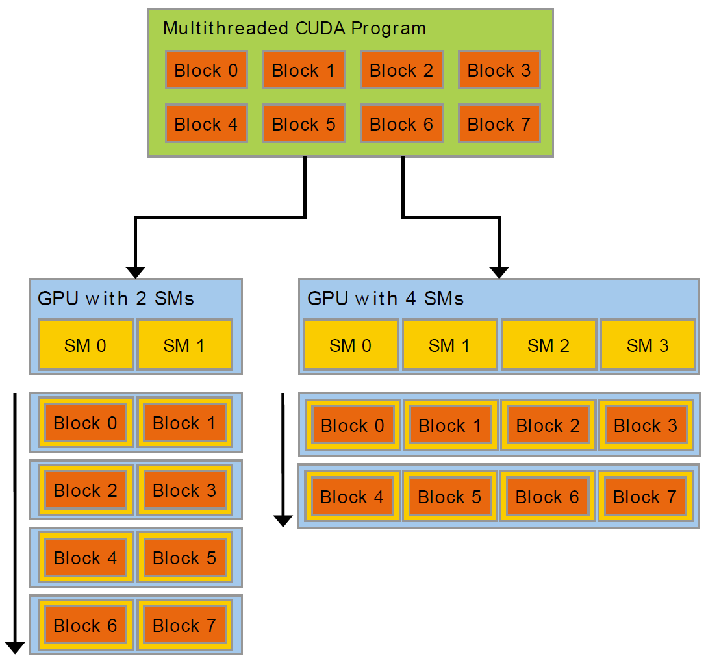

# 1. 简介
## 1.1 图像处理到通用并行计算的演变
市场对实时的、高精度的三维图形的需求是无法满足的，在这种需求的推动下，可编程图形处理器（GPU)已演变成高并行度、多线程的多核处理器，同时具有强大的计算能力和极高的存储器带宽，如图1和2所示：

图1. CPU和GPU的每秒浮点运算能力对比

图2. CPU和GPU的存储器带宽对比

造成CPU和GPU之间浮点运算能力的差距的原因在于，GPU是针对高计算密度和高并行化的场景设计的，图形渲染就属于这一类型的，这样就有更多的晶体管用来做数据处理而不是数据的缓存和流控，如图3所示

图3. GPU上更多的晶体管用于数据处理

具体来说，GPU非常适合于一些可以被抽象成data parallel的计算，即并行地对多个数据单元做相同的高计算密度（计算操作/存储器操作）的操作。由于在每个数据元素上执行同样的程序，我们就不需要复杂的流控，并且由于在大量的数据元素上同时执行，计算密度高。存储器访问的latency可以通过大量的计算隐藏（译者注：在大量的计算的同时，即将使用的数据可以提前准备，在真正使用数据的时候已经准备好，看起来像读取数据的过程被隐藏了）而无需使用大的cache。

Data parallel过程将数据元素映射到并行处理的线程Thread上。通常需要处理大数据集的程序都可使用data-parallel的编程模型来加速计算。在三维图形渲染中，像素和顶点通常被映射到并行的thread上。类似的，在图像渲染后处理、视频编解码、图像缩放、立体视觉和模式识别等图像和多媒体处理应用中，可以把图像块和像素映射到并行处理的线程上。事实上，data-parallel不仅用于图像渲染和处理的加速，还广泛应用于信号处理、物理仿真、计算金融和计算生物学中。

## 1.2 CUDA: 一种通用并行计算平台和编程模型
NVIDIA在2016年11月发布了CUDA，将其定义为一种通用并行计算平台和编程模型。相比于CPU，CUDA利用NVIDIA GPU中的并行计算引擎来更高效地解决复杂的计算问题。

CUDA提供了允许开发者使用C作为编程语言的的软件环境。如图4所示，其他语言、应用编程接口（API）或者编译制导（directive-based）的方法都有所支持，例如FORTRAN，DirectCompute和OpenACC。

图4. GPU计算应用

CUDA设计的初衷是支持多种语言和API

## 1.3 一种可扩展的编程模型
多核CPU和众核GPU的出现，意味着现在的主流处理器芯片已经是并行系统。此外，他们的并行度将继续以摩尔定律扩展。当前的挑战是开发可以透明地扩展并行度的软件，以利用数量上不断增加的处理器核心，类似三维图像应用可以在不同核心数的GPU上透明地扩展并行度。

CUDA并行模型的设计理念就是为了克服这样的挑战。并且对于熟悉传统编程语言譬如C的开发人员，能够保持一个相对不陡峭的学习曲线。

CUDA的核心是三种关键的抽象：thread group（线程组）的层次，shared memories（共享内存） 和 barrier synchronization（栅栏同步）。这是呈现给程序员的最小语言扩展集。

这些抽象提供了细粒度的data parallelism 和 thread parallelism（线程并行），嵌套在粗粒度的data parallelism和task parallelism（任务并行）中。它指导程序员将问题分成多个粗粒度的子问题，然后通过多个线程块（thread block）并行地解决这些子问题。而对于每个子问题来说，将其分解成更细粒度的操作，从而可以用block内的多个thread相互协作地并行处理。

这种分解通过允许多个thread可以协作处理子问题从而保留了语言的表达性，同时还能实现自动扩展。实际上，每个thread block可以以任何的顺序、并行或串行地被调度在GPU上任何一个可能的多处理器上（multiprocessor）上，这就使得一个编译得到的CUDA程序可以在任何数量的multiprocessor上执行，如图5所示，只有运行时(Runtime)系统需要知道处理器物理multiprocessor数。

图5. 自动扩展性

这种可扩展的编程模型使得GPU架构可以通过简单地调整multiprocessor数和存储器分区，延展到不同的市场范围：面向高性能发烧友的GeForce显卡，专业级的Quadro和Tesla计算卡；面向主流市场的平价GeForce显卡。（详见支持CUDA的GPU列表[link]）

GPU是围绕着流多处理器（Streaming Multiprocessors， SMs）设计制造的。一个多线程的程序被分解到各个线程块独立执行，因此拥有更多SM的GPU可以在更短的时间内完成程序的执行。

## 1.4 文档结构
本篇文档按如下章节组织：
- 第一章，简介，CUDA介绍
- 第二章，编程模型，概述编程模型
- 第三章，编程接口，介绍编程接口
- 第四章，硬件实现，介绍硬件实现
- 第五章，性能指南，给出一些实现最佳性能的建议
- 附录，支持CUDA的GPU，列出了所有支持CUDA的GPU
- 附录，C语言扩展，详细介绍了所有的C语言扩展
- 附录，Cooprative Groups，介绍CUDA thread各种group的同步原语
- 附录，CUDA Dynamic Parallelism，介绍了如何从另一个kernel中启动以及同步一个kernel
- 附录，数学函数，列出了CUDA支持的数学函数
- 附录，C/C++语言扩展，列出了device端代码支持的C++特性
- 附录，Texture获取，给出了texture获取的细节
- 附录，计算能力，给出了各种设备的技术规范和更多架构细节
- 附录，驱动API，介绍底层驱动API
- 附录，CUDA环境变量，列出了所有CUDA相关的环境变量
- 附录，Unified Memory编程，介绍了unified memory变成模型

# 2. 编程模型
本章通过C语言的示例，介绍CUDA编程模型的主要概念。更多的关于CUDA C的描述在编程接口章节给出。

本章及下一章中vector addition的完整代码可以在CUDA sample的vectorAdd中找到。

# 2.1 Kernels
CUDA